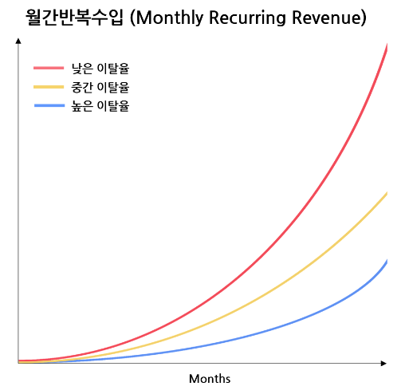
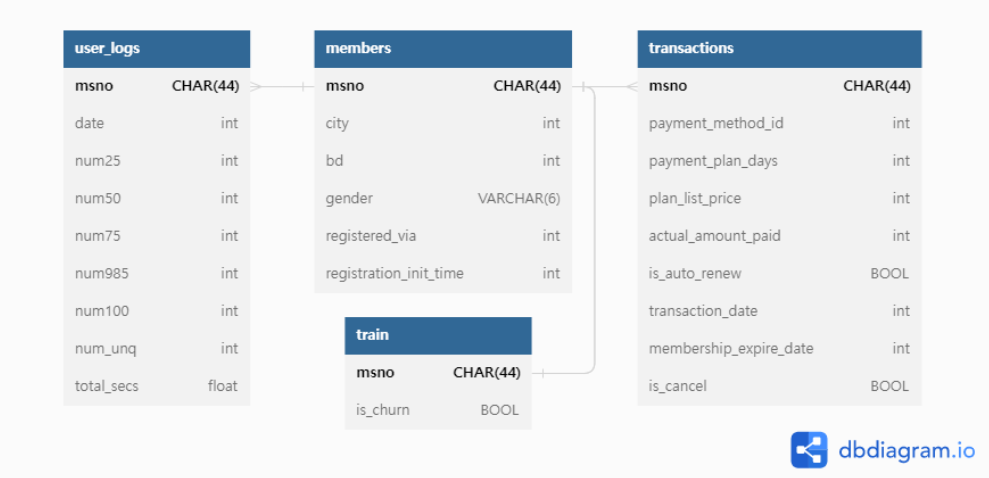
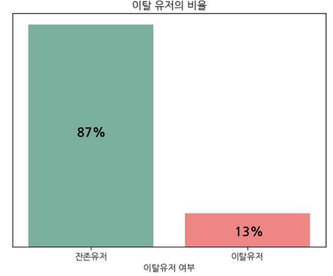
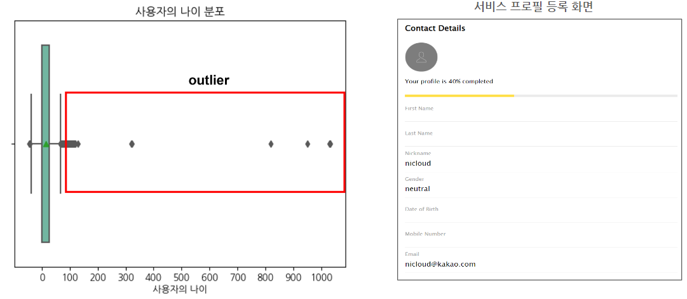
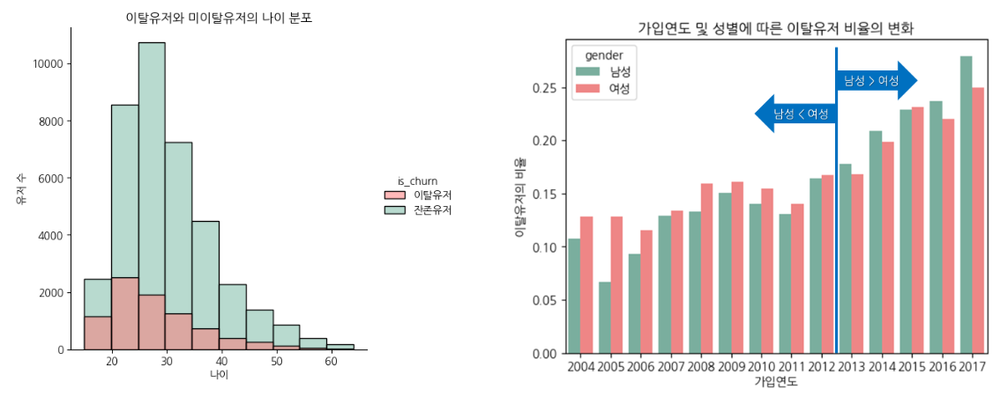
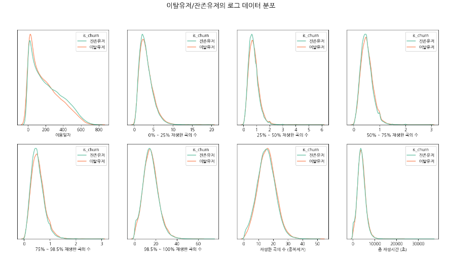
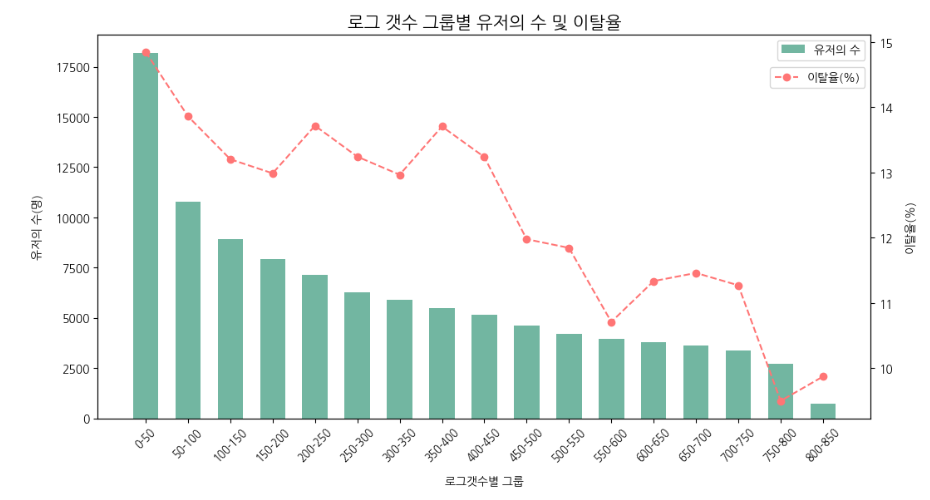
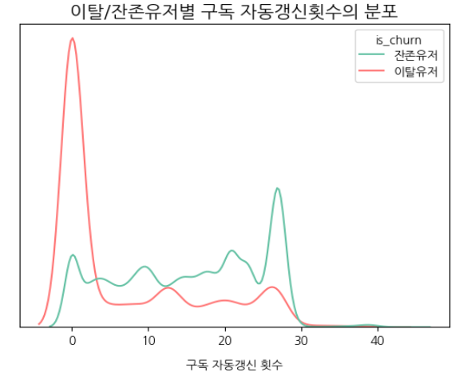
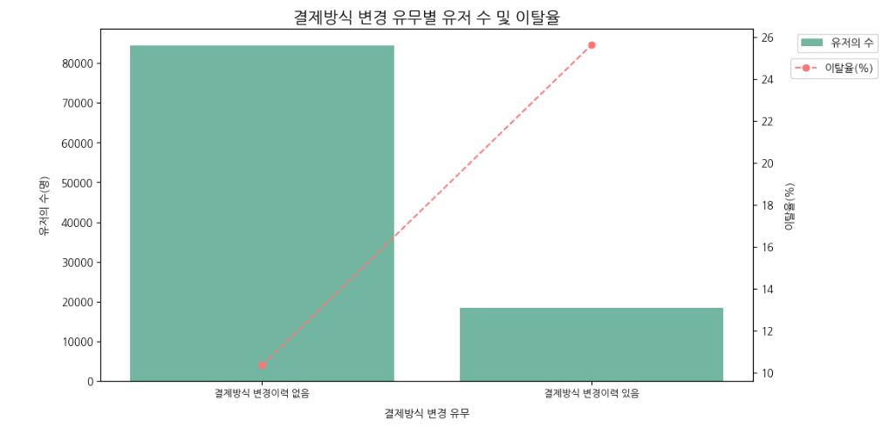
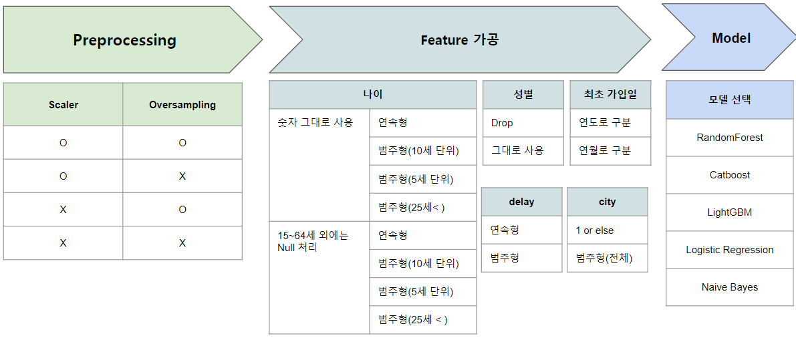

# 머신러닝을 활용한 이탈 고객 예측
data source by : https://www.kaggle.com/competitions/kkbox-churn-prediction-challenge

### 1. Table of Contents
---
### 2. 음원 스트리밍 서비스 KKBox의 이탈 고객 예측
#### 2-1. 분석 배경

매월 요금을 지불하는 구독 서비스에서 고객의 수는 매출과 직결되어 있습니다.
이에 따라 고객의 이탈은 수익의 하락을 유도하는 요인이 되며, 이탈 유저를 미리 예측하여 선제적인 대응을 한다면 수익의 저하를 막을 수 있을 것입니다.

#### 2-2. 문제 정의
**이탈(Churn)** 
Membership 만료 이후 30일 이내에 서비스 재구독을 하지 않은 경우 

**예측 대상의 범위** 
2017/03/31까지의 고객 데이터를 사용하며, 4월의 이탈 고객을 예측.

**Case 1. 고객 이탈**
|거래일|구독만료일|구독 취소 여부(0: 유지, 1: 취소)|
|------|----------|-------------|
|2017-01-01|2017-02-28|0|
|2017-02-25|2017-03-15|0|
|2017-04-30|2017-05-20|0|

Case 1의 경우 고객이 3월 15일 이후 구독을 연장하지 않았으며 30일이 지난 이후에 서비스를 재구독했으므로 이탈 고객으로 정의

**Case 2. 고객 이탈이 아님**
|거래일|구독만료일|구독 취소 여부(0: 유지, 1: 취소)|
|------|----------|-------------|
|2017-01-01|2017-02-28|0|
|2017-02-25|2017-04-03|0|
|2017-03-15|2017-03-16|1|
|2017-04-01|2017-06-30|0|

Case 2의 경우 고객이 3월 15일에 구독을 직접 해지하였으나, 구독 취소일로부터 30일 이내에 다시 구독하여 이탈하지 않은 고객으로 정의

**Case 3. 예측 대상이 아님**
|거래일|구독만료일|구독 취소 여부(0: 유지, 1: 취소)|
|------|----------|-------------|
|2017-01-01|2017-02-28|0|
|2017-02-25|2017-04-03|0|
|2017-03-15|2017-03-16|1|
|2017-03-18|2017-04-02|0|

Case 3의 경우 고객이 3월 15일에 구독을 직접 해지하였으나, 예측 대상인 4월까지 구독을 연장하며 이후의 데이터가 없어 이탈 여부를 확인할 수 없으므로 모델링의 대상에서 제외

#### 2-3. 데이터 소개 및 EDA
**데이터 소개**

데이터는 크게 고객 개인정보 데이터, 고객 거래 데이터, 사용 로그 데이터로 구분되어있습니다. 
고객 개인정보는 거주 도시, 나이, 성별 등의 데이터를 포함하고 있으며 
고객 거래 데이터는 고객의 구독 시작, 만료일, 요금 지불 방법 등의 데이터를 포함하고 있습니다. 
마지막으로 고객 로그 데이터는 사용일, 일별 총 재생 시간, 25% 이하로 재생한 음악의 수, 100% 재생한 음악의 수, unique한 재생 음악 수 등의 데이터를 포함하고 있습니다.
   

**고객 정보 데이터 EDA**

이탈 유저는 잔존 유저에 비해 상당히 적은 비율을 차지하여 모델링 단계에서 sampling에 유의할 필요가 있어 보입니다.
   

사용자의 나이에는 다수의 outlier가 분포해있음을 확인했습니다. 이는 고객의 실제 나이가 아닌 고객이 입력한 나이이기 때문임을 확인했습니다.
   

10대 후반에서 20대 초반까지의 연령대에서 다른 구간보다 이탈률이 높은 것을 확인했으며, 성별에 관계 없이 최근에 구독을 시작한 유저일수록 이탈율이 높은 것을 볼 수 있었습니다.
  

**유저 로그 데이터 EDA**

이탈 유저와 잔존 유저 간의 로그 데이터 분포에서는 큰 차이를 확인할 수 없었습니다.
   

로그의 수가 적은 유저 즉, 접속 일 수가 낮은 그룹에서는 높은 이탈율을 보임을 확인할 수 있었습니다.
  

**고객 거래 데이터 EDA**

이탈 유저의 경우 자동 구독 갱신 경험이 없는 쪽으로 다수가 분포해있으며, 반대로 잔존 유저의 경우 다수의 자동 갱신 경험을 하고 있음을 확인했습니다.
   

결제 방식을 변경한 경험이 있는 유저의 이탈율이 높은 것을 확인할 수 있었습니다.
  
추가적인 EDA 자료는 "3.Deck"의 ppt 자료를 참고해주시길 부탁드리겠습니다!
  

#### 2-4. 모델링

위의 다양한 EDA를 바탕으로 데이터 전처리 방법, Feature 가공 방법에 대한 경우의 수를 모두 설정하여 모델링 및 성능 테스트를 진행했습니다.
  

#### 2-5. 결과

**모델링 결과**

|구분|Model|Train Precision|Test Precision|Train Recall|Test Recall|
|---|-----|----------------|--------------|------------|-----------|
|Scaler X & Over-Sampling X|LGBM|0.77|0.73|0.41|0.39|
||Catboost|0.83|0.74|0.47|0.41|
|Scaler O & Over-Sampling X|LGBM|0.77|0.70|0.41|0.39|
||Catboost|0.83|0.70|0.47|0.42|
|Scaler X & Over-Sampling O|LGBM|0.91|0.49|0.89|0.56|
||Catboost|0.93|0.52|0.91|0.54|
|Scaler O & Over-Sampling O|LGBM|0.94|0.60|0.91|0.52|
||Catboost|0.97|0.68|0.92|0.46|

1. 전체적으로 Catboost 모델이 LGBM 모델에 비해 좋은 성능을 보였습니다.
2. Scaler 자체는 Precision과 Recall 향상에 큰 영향을 주지는 못하는 것으로 확인됩니다.
3. Over-Sampling을 하여 모델링을 할 경우 Train Precision과 Train Recall은 크게 향상된 반면 Test Precision은 크게 하락, Test Recall은 소폭 상승하며 과적합이 심화된 모습을 보였습니다.
4. 추가적으로 selectKBest, PCA를 통해 차원을 축소하여 추가 모델링을 해봤으나 성과는 미비했으며, 샘플 데이터를 2배 늘려서 테스트한 결과 과적합은 어느정도 개선된 모습을 보였습니다.

**결론 및 아쉬운 점**
1. EDA를 통해 이탈 유저와 비이탈 유저간에 유의미한 차이가 있음을 확인했습니다.
2. 전처리, 피쳐에 따라 모델을 구분하여 다양한 경우의 수에 대응하는 모델을 테스트하고 결과를 최적의 모델링 결과를 확인할 수 있었습니다.
3. 모델의 성능이 생각보다 낮게 나타나 아쉬움이 있었습니다.
4. 예상보다 서비스 이용 패턴(유저 로그)에서 유의미한 차이를 확인할 수 없었습니다.

---
### 3. Deck
PPT 자료입니다. 
[머신러닝을 활용한 고객 이탈 예측](https://docs.google.com/presentation/d/1Zt18I65J_wa49-KdVJAdPGbBV6F6y-AfmuxUN-TvFxk/edit?pli=1#slide=id.g2309d355225_0_74)

---
### 4. 분석 환경
- 모델
	- sklearn Version : 1.2.0
	- xgboost Version : 1.7.4
	- lightgbm Version : 3.2.1
	- catboost Version : 1.1.1
- 시각화
	- matplotlib Version : 3.6.2
	- seaborn Version : 0.12.2
- 데이터 전처리
	- sklearn Version : 1.2.0
	- pandas Version : 1.5.2 
	- numpy Version : 1.23.5
    - pyspark Version : 3.3.2
- 코딩 환경
	- Colab
	- Python 3.9